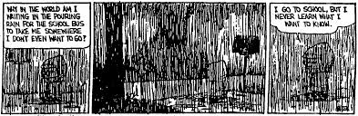
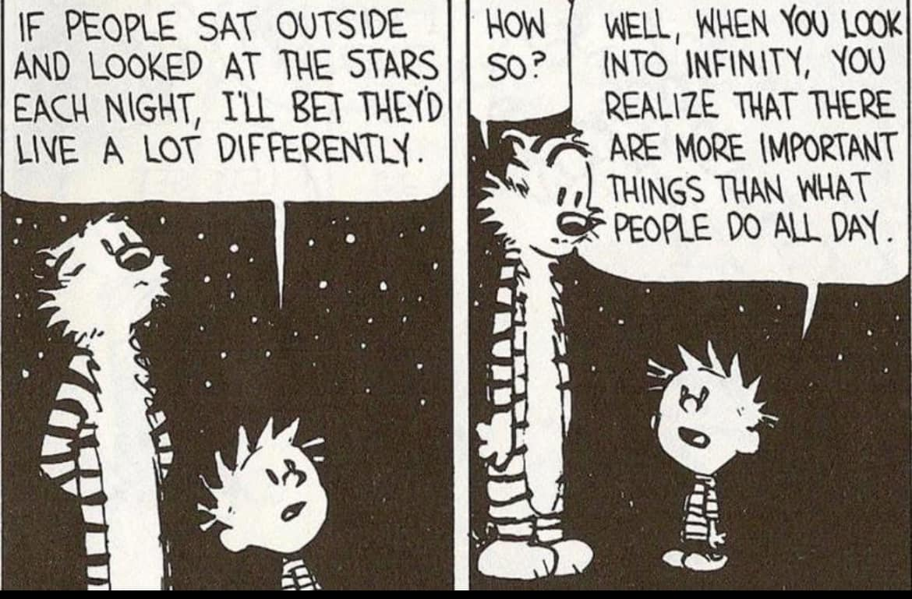
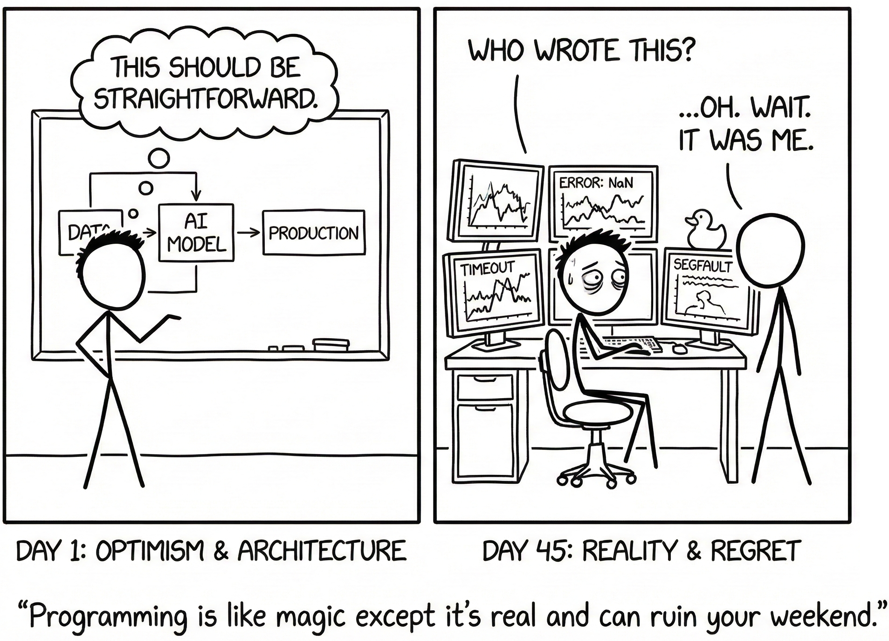
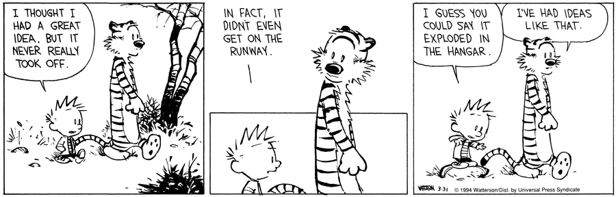

<!--
**bagminer/bagminer** is a ✨ _special_ ✨ repository because its `README.md` (this file) appears on your GitHub profile.

Here are some ideas to get you started:

- 🔭 I’m currently working on ...
- 🌱 I’m currently learning ...
- 👯 I’m looking to collaborate on ...
- 🤔 I’m looking for help with ...
- 💬 Ask me about ...
- 📫 How to reach me: ...
- 😄 Pronouns: ...
- ⚡ Fun fact: ...
-->

# Hi, I’m Bikram 👋

> I work on AI, ML, and data systems.  
> **Sometimes they work. Sometimes they teach humility.**

---

## 🧐 About This GitHub

Most of my real work lives in private repositories, regulated environments, or systems where the phrase **“just push it to GitHub”** is followed by a long pause and a compliance checklist.

### As Calvin once said:

> *“I go to school, but I never learn what I want to know.”*

  
   
  <em>Replace school with production systems and it still holds.</em>

---

## 🛠 What I Work On

* **AI & ML Systems:** Mostly in healthcare (where "oops" is not an acceptable error message).
* **NLP & LLMs:** RAG pipelines with guardrails.
* **The Lifecycle:** PoC → Production → Monitoring → *“How did this ever work?”*
* **Data Sources:** Humans, wearables, EHRs, satellites, and drones.
* **Other Works:** Geospatial, UAVs, LiDAR, and GIS.

### On Programming:

> *“Programming is like magic except it’s real and can ruin your weekend.”*

  
   
  <em>(Actual representation of my backend architecture)</em>

---

## 📉 Projects, Deadlines, and Optimism

Every project starts the same way:  
**“This should be straightforward.”**

Every project ends the same way:  
**“Who wrote this?”** *“…oh.”*

Deadlines are important, but reality is more important. I design systems assuming:
1.  Requirements **will** change.
2.  Data will be **worse** than promised.
3.  Monitoring will save **future-me**.
4.  **Future-me** will still complain.

---

## 🧪 I Like Experimenting

I experiment a lot. Not everything becomes a repo. Not everything should.

* Some experiments fail fast.
* Some fail slowly.
* A few survive long enough to meet production.

### As Calvin wisely observed:

> *“Sometimes I think the surest sign that intelligent life exists elsewhere is that none of it has tried to deploy our models.”*

  

 

Hard to argue.

---

## 🤖 AI, ML, and a Healthy Amount of Doubt

> *“Science isn’t about certainty. It’s about being less wrong tomorrow.”* > — XKCD (hopefully)

  

My default assumptions:
* Accuracy without context is **dangerous**.
* Models don’t understand; they **approximate**.
* If you can’t monitor it, you don’t **own** it.
* In healthcare, **false confidence** is worse than silence.

Or, in Calvin terms:

> *“I have plenty of ideas. Execution is where they go to be tested.”*

  

---

## 🔮 What You’ll Find Here 

* Small, thoughtful experiments.
* Architecture notes and system sketches.
* Lessons learned the hard way.
* Trade-offs instead of hype.

No rush. No content calendar.

  
   
  <em>“The future is exciting, but the bugs are already scheduled.”</em>

---

## ⚡ Why Follow `bagminer`?

If you enjoy:
* Thoughtful engineering
* Honest experimentation
* Humor as a coping strategy

You’ll probably feel at home here.

**I build when it makes sense. I publish when it helps someone else think better.**
